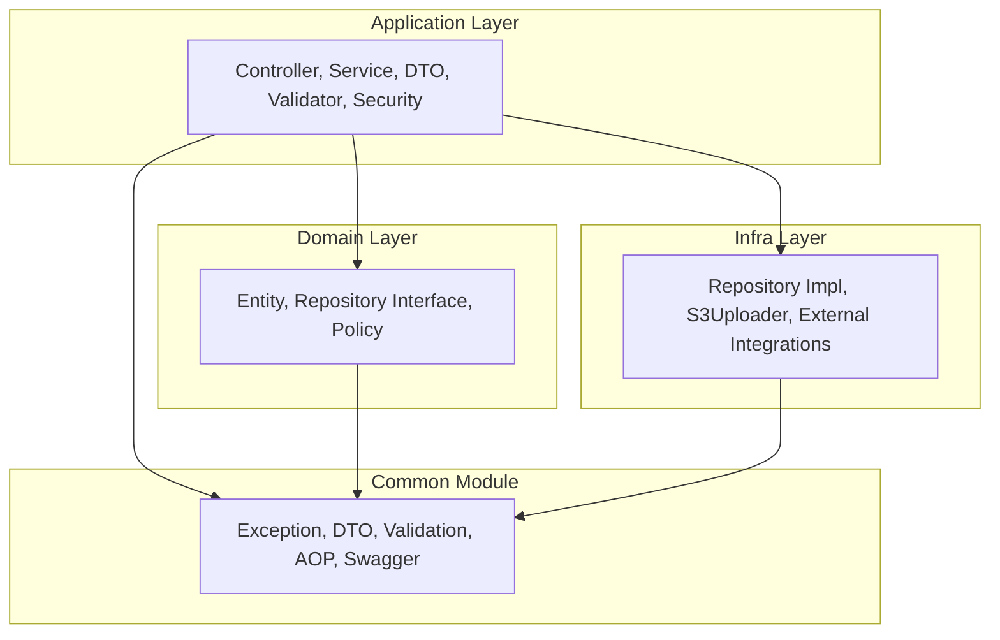
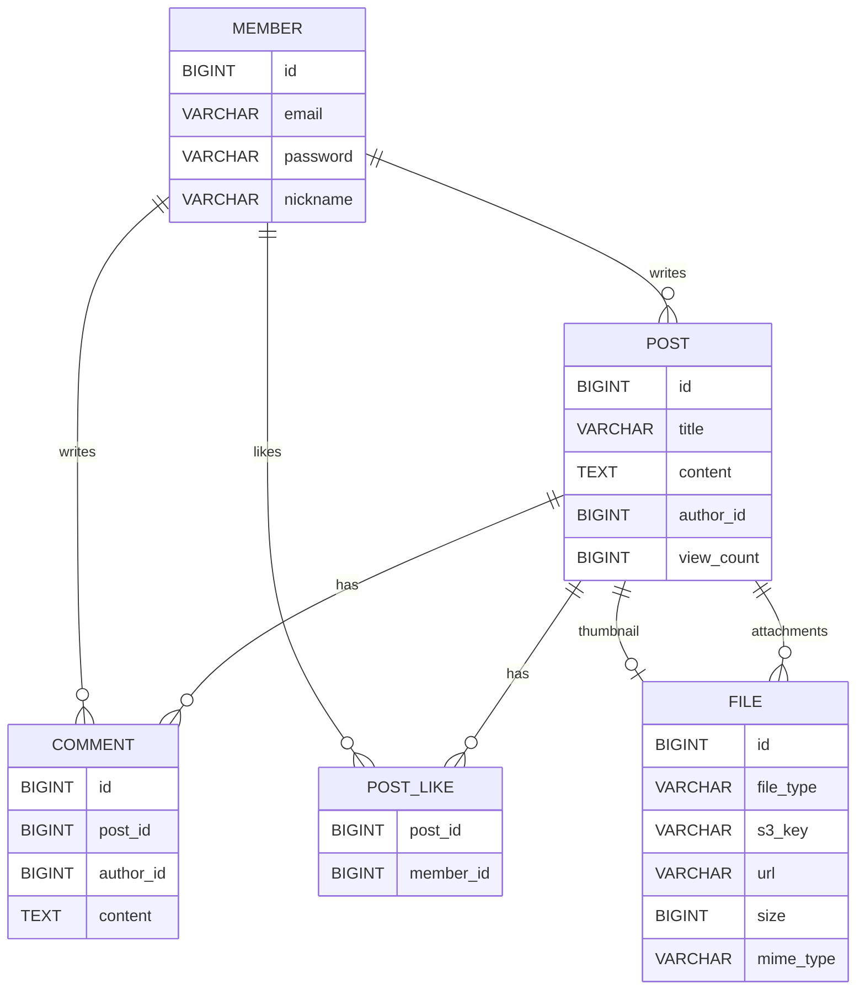

# TLog - 기술 블로그   (Backend)

기술 블로그·개발 커뮤니티를 위한 백엔드 & AI 지원 서버 프로젝트입니다.  
게시글/댓글/회원/파일 업로드 도메인을 중심으로, 읽기 많은 서비스와 AI 기반 기능을 동시에 지원하는 아키텍처를 목표로 합니다.

---

## 1. 프로젝트 소개

**한 줄 요약**  
기술 블로그와 개발 커뮤니티를 위한 Spring 기반 REST API + WebFlux AI 서버, 실서비스 수준의 성능·보안·아키텍처를 검증하기 위한 개인 사이드 프로젝트입니다.

**프로젝트 목적 및 의의**
- 기술 블로그/커뮤니티 도메인을 통해 **실제 서비스 트래픽 패턴(읽기 많은 서비스)** 을 가정한 설계·구현 연습
- **클린 아키텍처 + JPA + QueryDSL** 을 이용한 읽기/쓰기 분리, 조회 성능 최적화 패턴 학습
- **Spring Security + JWT + OAuth2** 를 적용한 인증/인가 흐름 정리
- **WebFlux 기반 AI 서버** 를 별도 모듈로 분리하고, Nginx 리버스 프록시로 통합하는 멀티 모듈 구조 실험
- S3 Presigned URL, Redis, Testcontainers 등 **실무에서 자주 쓰이는 기술 스택** 을 한 프로젝트 안에서 정리

**개발 기간**  
- 2025.03 ~ 2025.03 (1개월)

**개발 인원**  
- 1인 개인 프로젝트

**담당 역할**
- 전체 백엔드 아키텍처 설계 (`application / domain / infra` 3계층 & 멀티 모듈)
- 도메인 모델링(회원, 게시글, 댓글, 좋아요, 조회수, 파일)
- Spring MVC / WebFlux API 설계 및 구현
- Spring Security + JWT + OAuth2 인증/인가 설계 및 구현
- 파일 업로드(S3 Presigned URL) 및 이미지/파일 관리 도메인 설계
- 테스트 전략 수립(JUnit5, Testcontainers, 계층별 테스트 컨벤션) 및 CI(GitHub Actions) 구성

---

## 2. 사용 스킬

**Tech Stack (Skillicons)**


<br>


**기타 사용 기술 (아이콘 미제공 또는 보완 설명)**
- Spring Boot 3 (Web, Validation, Data JPA, Security, OAuth2 Client)
- Spring WebFlux, R2DBC(MySQL)
- JPA / QueryDSL 기반 복합 조회 및 동적 쿼리
- S3 Presigned URL 기반 파일 업로드 아키텍처
- Redis (조회수/캐시), Testcontainers (MySQL, Redis)
- springdoc-openapi(Swagger UI)
- JUnit5, Spring Test, Spring Security Test, JaCoCo

---

## 3. 기술적 고려 및 기능 설명

### 3-1. JPA + QueryDSL 기반 조회 최적화

- **읽기 많은 서비스**를 가정하고, 조회 쿼리 최적화를 중점적으로 설계
- `QueryDslSupport`, `QueryDslOrderUtil` 을 공통 유틸로 두어
  - Pageable의 `Sort` 정보를 QueryDSL `OrderSpecifier` 로 변환
  - DTO Projection을 이용해 **필요한 컬럼만 조회** (N+1 및 over-select 방지)
  - 복잡한 검색 조건을 `BooleanBuilder` / `BooleanExpression` 으로 동적 조립
- 게시글/댓글 조회에서
  - **요약 DTO / 상세 DTO 분리** 로 리스트 조회 최적화
  - 페이징 + 정렬(최신순, 인기순 등) 을 QueryDSL로 일관되게 처리

### 3-2. Spring Security + JWT + OAuth2

- **Spring Security** 기반으로 API 전역 인증/인가 구성
- **JWT 토큰** 발급/검증/갱신
  - Access Token / Refresh Token 구조
  - `JwtAuthenticationFilter`, `JwtExceptionFilter` 를 통한 인증 필터 체인 구성
  - `@CurrentUser` 커스텀 애노테이션으로 컨트롤러에서 현재 사용자 주입
- **OAuth2 (Google)** 로그인
  - Authorization Code Flow (서버 사이드 처리)
  - OAuth2 로그인 이후 JWT 발급 및 기존 회원 시스템과 연동
- 예외/에러 응답 규격 통일
  - `GlobalExceptionHandler`, `ErrorCode` 기반 공통 에러 응답
  - Spring Security 인증/인가 예외를 커스텀 핸들러로 래핑

### 3-3. MVC and WebFlux 분리 (멀티 모듈)

- `app-api` (Spring MVC)
  - 블로그/커뮤니티 핵심 도메인 REST API
  - 게시글, 댓글, 좋아요, 조회수, 회원, 파일 등 CRUD + 비즈니스 로직
  - 동기 HTTP 요청에 최적화 (일반 웹/모바일 클라이언트)
- `app-webflux` (Spring WebFlux)
  - AI 텍스트 요약/생성/리뷰 등 **LLM 기반 기능**을 비동기 처리
  - `/ai/chat`, `/ai/generate`, `/ai/summarize`, `/ai/review` 등 API 제공
  - SSE 기반 스트리밍 응답(`/stream` 계열 엔드포인트)으로 토큰 단위 결과 전송
  - R2DBC(MySQL)로 논블로킹 DB 접근 구성
- 두 모듈은 **서로 독립 배포 가능** 하며, Nginx 리버스 프록시로 한 도메인 아래로 통합

### 3-4. Reverse Proxy Nginx

- `infra/nginx/nginx.conf` 에서 다음과 같이 라우팅
  - `/api/**` → `app-api` (Spring MVC)
  - `/webflux/**` → `app-webflux` (Spring WebFlux, SSE/AI 스트리밍)
- 공통 헤더(`X-Forwarded-*`, `Upgrade`, `Connection`) 설정으로
  - SSL 종료, 로드 밸런싱, WebSocket/SSE 대응 고려
- 실제 서비스 환경을 가정하여 **API 서버와 AI 서버를 게이트웨이 뒤에 배치**하는 구조 연습

### 3-5. 이미지 / 파일 업로드 (S3 Presigned URL)

- S3를 활용한 파일 저장 전략을 정리하고, **단일 File 엔티티 + subtype 구분 전략** 채택
  - `File` 엔티티 하나에서 이미지/동영상/문서(PDF) 공통 메타데이터 관리
  - 필요 시 서브테이블(`FileVideoMeta` 등)로 확장 가능하게 설계
- 업로드 플로우
  1. 클라이언트가 서버에 **Presigned URL 발급 요청**
  2. 서버에서 S3에 Presigned URL 생성 후 클라이언트에 반환
  3. 클라이언트가 Presigned URL로 S3에 직접 업로드
  4. 업로드 완료 후 서버에 메타데이터 등록(파일 크기/타입/URL 등)
- 장점
  - 대용량 파일 업로드 시 서버 부하 및 I/O 비용 최소화
  - 업로드 정책 검증 및 파일 메타데이터 관리를 서버에서 일원화
  - 향후 대규모 트래픽/대용량 파일 서비스로 확장 용이

### 3-6. 조회수/좋아요 & Redis, 동시성 이슈 대응

- 게시글 조회수
  - Redis를 이용해 조회수 증가를 버퍼링 후 DB에 반영하는 정책 설계
  - 조회수 정책을 별도 Policy/ADR 문서로 정리하여 **읽기 많은 서비스에서의 조회수 설계**를 명확히 기록
- 좋아요
  - `PostLike` 복합 키 및 제약 조건으로 **중복 좋아요 방지**
  - 동시성 이슈(같은 사용자의 동시 요청 등)를 고려한 트랜잭션 및 Lock 전략 ADR 정리

### 3-7. 테스트 전략 및 CI

- 테스트 레이어링
  - 단위 테스트: 도메인 정책, Validator, 순수 로직 검증
  - 슬라이스 테스트: 컨트롤러(WebMvcTest), 리포지토리(JPA), 시큐리티 등 부분 단위 검증
  - 통합 테스트: API 흐름, 보안, 파일 업로드 Presigned URL 플로우 전체 검증
- Testcontainers
  - MySQL, Redis 컨테이너를 띄워 **로컬/CI 환경에서 실제에 가까운 테스트 환경** 제공
  - `EmbeddedRedisConfig` 로 Redis 컨테이너 구성
- CI (GitHub Actions)
  - `./.github/workflows/ci.yml` 에서
    - JDK 21 세팅
    - `./gradlew test` 실행 후
    - `./gradlew build -x test` 빌드
    - 테스트 결과 및 JaCoCo 리포트 아티팩트 업로드

---

## 4. 아키텍처

### 4-1. 전체 시스템 구성도

```mermaid
graph LR
    Client["Web / Mobile / Admin"] --> Nginx["Nginx Reverse Proxy"]

    Nginx --> API["app-api (Spring MVC)"]
    Nginx --> WebFlux["app-webflux (Spring WebFlux)"]

    API --> MySQL["MySQL (JPA)"]
    API --> Redis["Redis (Cache / View Count)"]
    API --> S3["AWS S3 (File Storage)"]

    WebFlux --> MySQL_R2DBC["MySQL (R2DBC)"]
    WebFlux --> "External LLM API"
```

### 4-2. 모듈/레이어 구조 (Clean Architecture)



- `application`: 유스케이스 중심 계층 (컨트롤러/서비스/DTO/Validator/시큐리티)
- `domain`: 엔티티, 리포지토리 인터페이스, Policy 등 비즈니스 규칙
- `infra`: JPA 구현체, S3Uploader, 외부 시스템 연동
- `common`: 예외/응답/검증/AOP/Swagger 등 공통 모듈

자세한 설계 배경은 `docs/architecture/CLEAN_ARCHITECTURE.md`, `docs/architecture/FILE-ARCHITECTURE.md` 를 참고할 수 있습니다.

---

## 5. ERD

핵심 도메인 기준 ERD 개요입니다. (실제 필드는 프로젝트 코드 기준으로 확장되어 있습니다.)



자세한 파일 엔티티/메타데이터 구조는 `docs/architecture/FILE-ARCHITECTURE.md` 에서 확인할 수 있습니다.

---

## 6. 실행 방법

```bash
# 의존성 설치 & 빌드
./gradlew build

# 로컬 실행 (MySQL, Redis, S3 관련 환경 변수 필요)
./gradlew :app-api:bootRun      # REST API 서버
./gradlew :app-webflux:bootRun  # WebFlux AI 서버

# 테스트 실행
./gradlew test                  # 전체 테스트
# 프로젝트 설정에 따라 아래와 같이 세분화된 Task 사용
./gradlew unitTest              # 단위 테스트
./gradlew integrationTest       # 통합 테스트
```

로컬 개발 시 필요한 환경 값 예시는 `.env.example` 또는 `docker-compose.yml`, `infra/` 설정 파일을 참고해 주세요.

---

## 7. 개인 블로그 링크

아키텍처/설계/트러블슈팅에 대한 자세한 회고는 개인 블로그에 정리할 예정입니다.

- [블로그 1](https://example.com) <!-- TODO: 실제 블로그 링크로 교체 -->
- [블로그 2](https://example.com) <!-- TODO: 실제 블로그 링크로 교체 -->

프로젝트 진행 과정에서 작성한 ADR, 설계 문서, 트러블슈팅 기록은 `docs/` 디렉터리에서 바로 확인할 수 있습니다.
