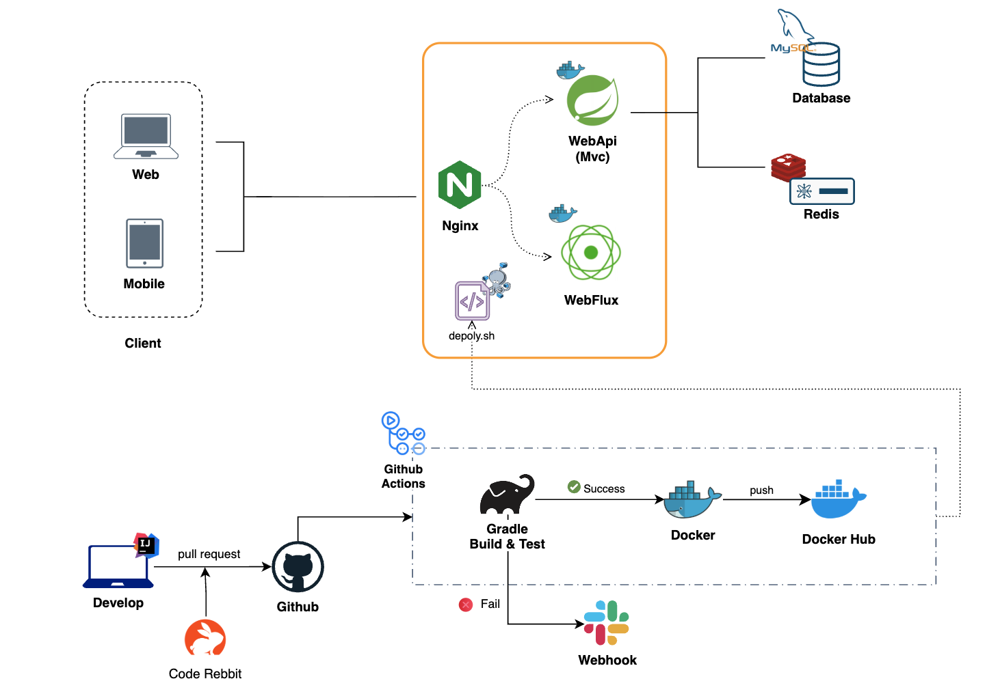
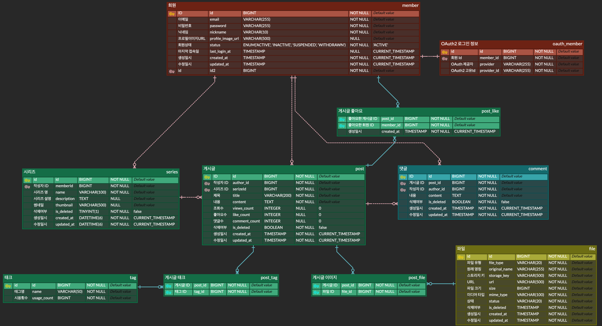

# T-Log Backend

> 팀·사내에서 바로 사용할 수 있는 **기술 블로그 템플릿 백엔드**입니다.  
> 게시글/댓글/회원/파일 업로드 도메인을 기반으로, 읽기 많은 기술 블로그 서비스를 빠르게 시작할 수 있게 하는 것을 목표로 합니다.

---

## 1. 프로젝트 소개

팀과 사내에서 공용으로 사용할 수 있는 기술 블로그 백엔드 템플릿(T-Log)을 제공하는 프로젝트입니다.

**프로젝트 목적 및 의의**
- 팀 기술 블로그, 사내 엔지니어링 블로그, 커뮤니티 등에서 **공통으로 필요한 기능**(게시글, 댓글, 파일, 통계)을 빠르게 도입할 수 있는 템플릿 제공
- 읽기 많은 기술 블로그 서비스에서의 **조회 성능, 파일 업로드, 인증/인가, 테스트 전략**을 한 번에 정리
- 멀티 모듈/멀티 런타임 구조를 통해 **일반 API와 AI 기능을 분리 배포**할 수 있는 패턴 제시

**개발 기간 / 인원**  
2025.03, 1인 개인 프로젝트  
백엔드 전체 설계·구현 (아키텍처, 도메인 모델, MVC/WebFlux API, 인증/인가, 파일 업로드, 테스트·CI)

 

---

## 2. 사용 스킬

- Spring WebFlux + R2DBC, Spring Security + JWT + OAuth2
- JPA + QueryDSL, Testcontainers, springdoc-openapi, JaCoCo

 

---

## 3. 기술적 고려 및 기능 설명

- JPA + QueryDSL 기반 조회 최적화  
  - 요약/상세 DTO 분리, DTO 프로젝션, 동적 정렬/필터링으로 **읽기 많은 블로그 조회 성능** 최적화
- MVC / WebFlux 모듈 분리  
  - 일반 REST 트래픽과 LLM·스트리밍 트래픽을 분리 배포해 **성능·확장성·장애 격리** 확보
- Nginx 리버스 프록시  
  - `/api` 와 `/webflux` 를 서로 다른 백엔드로 라우팅하여 **API / AI 서버 역할 분리** 및 게이트웨이 일원화
- S3 Presigned URL 기반 파일 업로드  
  - 서버를 거치지 않고 S3로 직접 업로드하여 **대용량 파일 업로드 시 서버 I/O 부하를 줄이는 구조** 선택 (vs 단순 Multipart 업로드)
- Redis 기반 조회수·좋아요 설계  
  - Redis 버퍼링 + 복합키(PostLike)로 **조회수 정합성·중복 좋아요·동시성 이슈**를 완화
- 테스트 전략 및 CI  
  - Testcontainers와 GitHub Actions를 활용해 **실제와 유사한 환경에서 자동 테스트·빌드·커버리지 수집** 구성

자세한 설계 배경 및 트레이드오프는 다음 문서를 참고할 수 있습니다.
- [CLEAN_ARCHITECTURE.md](docs/architecture/CLEAN_ARCHITECTURE.md)
- [FILE-ARCHITECTURE.md](docs/architecture/FILE-ARCHITECTURE.md)
- [QUERYDSL_DECISIONS.md](docs/querydsl/QUERYDSL_DECISIONS.md)
- [FILE-UPLOAD-PRESIGNED-VS-MULTIPART.md](docs/file-upload/FILE-UPLOAD-PRESIGNED-VS-MULTIPART.md)

 

---

## 4. 아키텍처

자세한 설계 배경 및 레이어 구조는 [CLEAN_ARCHITECTURE.md](docs/architecture/CLEAN_ARCHITECTURE.md) 를 참고할 수 있습니다.

 

---

## 5. ERD

 

---

## 6. 관련 모듈 & 프론트엔드

- API 서버 (Spring MVC): [app-api/README.md](app-api/README.md)
- WebFlux AI 서버: [app-webflux/README.md](app-webflux/README.md)
- 프론트엔드 (Next.js / React): https://github.com/100-hours-a-week/3-devon-woo-community-FE
