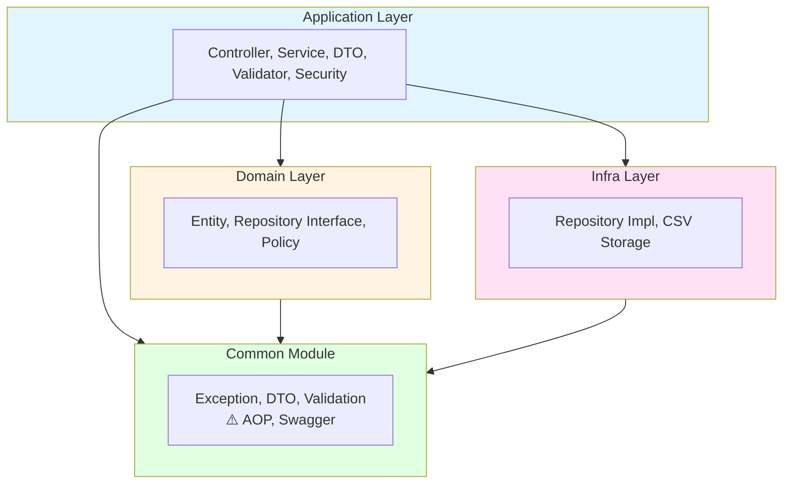

# 클린 아키텍처 가이드

> 커뮤니티 프로젝트의 클린 아키텍처 설계 원칙 및 레이어 구조

## 개요

본 프로젝트는 **클린 아키텍처(Clean Architecture)** 원칙을 기반으로 설계되었습니다. 각 레이어는 명확한 책임을 가지며, 의존성 방향이 엄격하게 제어됩니다.

---

## 아키텍처 레이어



**의존성 방향**
- Application Layer → Domain, Infra, Common
- Domain Layer → Common
- Infra Layer → Common
- Common Module → (독립적)

---

## 레이어별 상세 설명

### 1. Common Module

**패키지**: `com.kakaotechbootcamp.community.common`

#### 역할
- 모든 레이어에서 공통적으로 사용되는 유틸리티 및 기반 기능 제공
- **프레임워크 독립적인 순수 Java 코드 지향**
- **최소한의 외부 라이브러리 의존성 유지**

#### 포함 요소
- **exception**: 공통 예외 처리
  - `CustomException`, `GlobalExceptionHandler`
  - `ErrorCode` 인터페이스 및 구현체들
- **dto**: 공통 DTO
  - `ApiResponse`, `FieldError`
- **validation**: 유효성 검증 상수
  - `ValidationMessages`, `ValidationPatterns`
- **aop**: 횡단 관심사 (⚠️ Spring 의존성 있음 - 추후 리팩토링 고려)
  - `ApiLoggingAspect`, `ServicePerformanceAspect`, `TransactionalQueryLoggingAspect`
- **swagger**: API 문서화 설정 (⚠️ Spring 의존성 있음 - 추후 리팩토링 고려)
  - `SwaggerConfig`, `SwaggerResponseDescription`

#### 의존성 규칙
- ✅ 외부 의존: **최소한** (순수 Java 우선, 불가피한 경우에만 외부 라이브러리)
- ❌ 내부 의존: **다른 레이어를 참조하지 않음**

#### 원칙
> **Common 모듈은 가능한 한 순수 Java 객체로만 구성되어야 합니다.**
>
> Spring, Servlet API 등 프레임워크에 의존하는 설정이나 컴포넌트는 **Application 레이어**에 위치해야 합니다.
>
> 현재 `common/aop`, `common/swagger`는 이 원칙을 일부 위반하고 있으며, 추후 리팩토링 대상입니다.

#### 예시 코드
```java
// common/exception/ErrorCode.java
public interface ErrorCode {
    String getCode();
    String getMessage();
    HttpStatus getHttpStatus();
}

// common/dto/api/ApiResponse.java
public record ApiResponse<T>(
    boolean success,
    T data,
    String message
) {}
```

---

### 2. Domain Layer

**패키지**: `com.kakaotechbootcamp.community.domain`

#### 역할
- 핵심 비즈니스 로직과 도메인 규칙 포함
- 프레임워크에 독립적인 순수 비즈니스 로직
- 엔티티, 리포지토리 인터페이스, 도메인 정책 정의

#### 포함 요소
- **entity**: 도메인 엔티티
  - `Member`, `Post`, `Comment`, `PostLike`
  - 복합 키: `PostLikeId`
- **repository**: 리포지토리 인터페이스
  - `MemberRepository`, `PostRepository`, etc.
  - 인터페이스만 정의 (구현은 Infra Layer)
- **policy**: 도메인 정책
  - `PostViewPolicy`, `PostLikePolicy`
- **dto**: 도메인 전용 DTO
  - `PostSearchCondition` 등
- **config**: 도메인 레벨 설정
  - `QueryDslConfig`

#### 의존성 규칙
- ✅ 의존 가능: **Common**
- ❌ 의존 불가: Application, Infra

#### 예시 코드
```java
// domain/member/entity/Member.java
@Entity
@Getter
@Table(name = "members")
public class Member {
    @Id
    @GeneratedValue(strategy = GenerationType.IDENTITY)
    private Long id;

    private String email;
    private String password;

    // 도메인 로직
    public void changePassword(String newPassword) {
        this.password = newPassword;
    }
}

// domain/member/repository/MemberRepository.java
public interface MemberRepository extends JpaRepository<Member, Long> {
    Optional<Member> findByEmail(String email);
}
```

---

### 3. Infra Layer

**패키지**: `com.kakaotechbootcamp.community.infra`

#### 역할
- 외부 시스템과의 통합 및 인프라 관련 구현
- 리포지토리 구현체, 외부 저장소 연동
- 기술적 세부사항 처리

#### 포함 요소
- **repository**: 리포지토리 구현
  - `CustomJpaRepository`, `CustomJpaRepositoryImpl`
  - `CrudStorage` 인터페이스
- **csv**: CSV 기반 저장소 (레거시)
  - `GenericCsvStorage`

#### 의존성 규칙
- ✅ 의존 가능: **Common**, Domain (인터페이스 구현)
- ❌ 의존 불가: Application

#### 예시 코드
```java
// infra/repository/CustomJpaRepositoryImpl.java
public class CustomJpaRepositoryImpl<T, ID>
    extends SimpleJpaRepository<T, ID>
    implements CustomJpaRepository<T, ID> {

    // JPA 기반 구현
}
```

---

### 4. Application Layer

**패키지**: `com.kakaotechbootcamp.community.application`

#### 역할
- 사용자 요청 처리 및 응답
- 유스케이스(Use Case) 구현
- 트랜잭션 경계 설정

#### 포함 요소
- **controller**: REST API 엔드포인트
  - `AuthController`, `MemberController`, `PostController`, `CommentController`
- **service**: 애플리케이션 서비스
  - `LoginService`, `SignupService`, `MemberService`, `PostService`, `CommentService`
- **dto**: 요청/응답 DTO
  - `request/`: `LoginRequest`, `SignupRequest`, `CreatePostRequest` 등
  - `response/`: `MemberResponse`, `PostResponse`, `CommentResponse` 등
- **validator**: 비즈니스 유효성 검증
  - `MemberValidator`, `AuthValidator`
- **security**: 보안 인프라 설정 (Spring Security)
  - `config/`: `SecurityConfig`
  - `filter/`: `JwtAuthenticationFilter`, `JwtExceptionFilter`
  - `handler/`: `CustomAuthenticationEntryPoint`, `CustomAccessDeniedHandler`
  - `provider/`: `JwtTokenProvider`
  - `service/`: `CustomUserDetailsService`

#### 의존성 규칙
- ✅ 의존 가능: **Common**, **Domain**, **Infra**
- ❌ 의존 불가: 없음 (최상위 레이어)

#### 예시 코드
```java
// application/auth/controller/AuthController.java
@RestController
@RequestMapping("/api/v1/auth")
public class AuthController {
    private final LoginService loginService;

    @PostMapping("/login")
    public ApiResponse<LoginResponse> login(@RequestBody LoginRequest request) {
        return loginService.login(request);
    }
}

// application/auth/service/LoginService.java
@Service
@Transactional(readOnly = true)
public class LoginService {
    private final MemberRepository memberRepository; // Domain 의존

    public LoginResponse login(LoginRequest request) {
        // 비즈니스 로직
    }
}
```

---

### 5. Config Layer

**패키지**: `com.kakaotechbootcamp.community.config`

#### 역할
- 프레임워크 및 라이브러리 전역 설정
- Spring Boot 애플리케이션 설정

#### 포함 요소
- `WebMvcConfig`: CORS, Interceptor 등 Web MVC 설정
- `CloudinaryConfig`: 이미지 스토리지 설정

#### 의존성 규칙
- ✅ 의존 가능: **Common**, Domain, Infra
- 설정 성격상 필요에 따라 모든 레이어 참조 가능

#### 참고
- Spring Security 설정은 `application/security/config`에 위치 (프레임워크 의존성이 강하므로)

---

## 의존성 흐름도

```
Application Layer
    │
    ├─→ Domain Layer ──→ Common Module
    │
    ├─→ Infra Layer  ──→ Common Module
    │
    └─→ Common Module
```

### 핵심 규칙

1. **의존성 방향은 항상 안쪽(Common)으로**
   - 외부 레이어는 내부 레이어를 참조 가능
   - 내부 레이어는 외부 레이어를 참조 불가

2. **Common은 독립적**
   - 다른 레이어를 참조하지 않음
   - 최소한의 외부 라이브러리 의존성

3. **Domain은 순수하게**
   - 프레임워크 독립적인 비즈니스 로직
   - Infra 세부사항에 의존하지 않음

4. **Infra는 구현만**
   - Domain의 인터페이스를 구현
   - Application을 참조하지 않음

---

## 패키지 구조 예시

```
src/main/java/com/kakaotechbootcamp/community/
├── config/                          # 전역 설정
│   ├── WebMvcConfig.java
│   └── CloudinaryConfig.java
│
├── common/                          # 공통 모듈
│   ├── exception/
│   │   ├── CustomException.java
│   │   ├── GlobalExceptionHandler.java
│   │   ├── ErrorCode.java
│   │   └── code/
│   │       ├── CommonErrorCode.java
│   │       ├── MemberErrorCode.java
│   │       └── PostErrorCode.java
│   ├── dto/api/
│   │   ├── ApiResponse.java
│   │   └── FieldError.java
│   ├── validation/
│   │   ├── ValidationMessages.java
│   │   └── ValidationPatterns.java
│   ├── aop/
│   │   ├── ApiLoggingAspect.java
│   │   └── ServicePerformanceAspect.java
│   └── swagger/
│       └── SwaggerConfig.java
│
├── domain/                          # 도메인 레이어
│   ├── common/
│   │   ├── entity/BaseEntity.java
│   │   ├── repository/QueryDslSupport.java
│   │   └── policy/
│   ├── config/
│   │   └── QueryDslConfig.java
│   ├── member/
│   │   ├── entity/Member.java
│   │   └── repository/MemberRepository.java
│   └── post/
│       ├── entity/
│       │   ├── Post.java
│       │   ├── PostLike.java
│       │   └── id/PostLikeId.java
│       ├── repository/
│       │   ├── PostRepository.java
│       │   └── impl/PostRepositoryImpl.java
│       ├── policy/
│       │   ├── PostViewPolicy.java
│       │   └── PostLikePolicy.java
│       └── dto/PostSearchCondition.java
│
├── infra/                           # 인프라 레이어
│   ├── repository/
│   │   ├── CustomJpaRepository.java
│   │   ├── CustomJpaRepositoryImpl.java
│   │   └── CrudStorage.java
│   └── csv/
│       └── GenericCsvStorage.java
│
└── application/                     # 애플리케이션 레이어
    ├── auth/
    │   ├── controller/AuthController.java
    │   ├── service/
    │   │   ├── LoginService.java
    │   │   └── SignupService.java
    │   ├── dto/
    │   │   ├── LoginRequest.java
    │   │   ├── SignupRequest.java
    │   │   └── LoginResponse.java
    │   └── validator/AuthValidator.java
    ├── member/
    │   ├── controller/MemberController.java
    │   ├── service/MemberService.java
    │   ├── dto/
    │   │   ├── request/UpdateMemberRequest.java
    │   │   └── response/MemberResponse.java
    │   └── validator/MemberValidator.java
    ├── post/
    │   ├── controller/PostController.java
    │   ├── service/PostService.java
    │   └── dto/
    │       ├── request/CreatePostRequest.java
    │       └── response/PostResponse.java
    ├── comment/
    │   ├── controller/CommentController.java
    │   ├── service/CommentService.java
    │   └── dto/
    │       ├── request/CreateCommentRequest.java
    │       └── response/CommentResponse.java
    └── security/                        # 보안 설정
        ├── config/
        │   └── SecurityConfig.java
        ├── filter/
        │   ├── JwtAuthenticationFilter.java
        │   └── JwtExceptionFilter.java
        ├── handler/
        │   ├── CustomAuthenticationEntryPoint.java
        │   └── CustomAccessDeniedHandler.java
        ├── provider/
        │   └── JwtTokenProvider.java
        └── service/
            └── CustomUserDetailsService.java
```

---

## 새로운 기능 추가 가이드

### 예: Spring Security 추가

Spring Security는 **Application 레이어**에 위치해야 합니다.

#### 이유
1. **프레임워크 강한 의존성**: Spring Security는 Spring Framework에 강하게 결합됨
2. **애플리케이션 레벨 정책**: 인증/인가는 비즈니스 요구사항을 반영한 애플리케이션 정책
3. **Common 원칙 준수**: Common은 순수 Java 지향, 프레임워크 의존성 최소화
4. **auth 패키지와 연관성**: 기존 `application/auth`와 밀접하게 연관

#### 채택한 구조
```
application/security/
├── config/
│   └── SecurityConfig.java
├── filter/
│   ├── JwtAuthenticationFilter.java
│   └── JwtExceptionFilter.java
├── handler/
│   ├── CustomAuthenticationEntryPoint.java
│   └── CustomAccessDeniedHandler.java
├── provider/
│   └── JwtTokenProvider.java
└── service/
    └── CustomUserDetailsService.java
```

#### 클린 아키텍처 준수
- ✅ Application 레이어에서 Domain의 Member 엔티티 참조 가능
- ✅ Spring Security 의존성을 Application 레이어에 격리
- ✅ Common 모듈의 순수성 유지

---

## 레이어 위반 감지

### ❌ 잘못된 예시

```java
// domain/member/entity/Member.java
import com.kakaotechbootcamp.community.application.member.dto.MemberResponse;

// ❌ Domain이 Application 레이어를 참조
public class Member {
    public MemberResponse toResponse() { ... }
}
```

```java
// common/exception/GlobalExceptionHandler.java
import com.kakaotechbootcamp.community.domain.member.repository.MemberRepository;

// ❌ Common이 Domain 레이어를 참조
@RestControllerAdvice
public class GlobalExceptionHandler {
    private final MemberRepository memberRepository; // 잘못된 의존성
}
```

### ✅ 올바른 예시

```java
// application/member/service/MemberService.java
import com.kakaotechbootcamp.community.domain.member.entity.Member;
import com.kakaotechbootcamp.community.domain.member.repository.MemberRepository;
import com.kakaotechbootcamp.community.common.exception.CustomException;

// ✅ Application이 Domain, Common 참조
@Service
public class MemberService {
    private final MemberRepository memberRepository;

    public MemberResponse getMember(Long id) {
        Member member = memberRepository.findById(id)
            .orElseThrow(() -> new CustomException(MemberErrorCode.MEMBER_NOT_FOUND));
        return MemberResponse.from(member);
    }
}
```

---

## 정리

### 핵심 원칙

1. **계층 간 의존성은 단방향**
   - Application → Domain, Infra, Common
   - Domain → Common
   - Infra → Common
   - Common → (없음)

2. **Common은 최소한의 의존성**
   - 순수 Java 지향
   - 필수 프레임워크만 의존

3. **Domain은 순수성 유지**
   - 비즈니스 로직에 집중
   - 프레임워크 독립적

4. **각 레이어는 명확한 책임**
   - 단일 책임 원칙 준수
   - 관심사의 분리

### 장점

- ✅ **테스트 용이성**: 각 레이어 독립적 테스트 가능
- ✅ **유지보수성**: 변경 영향 범위 최소화
- ✅ **확장성**: 새로운 기능 추가 시 구조 명확
- ✅ **재사용성**: Common 모듈 다른 프로젝트 재사용 가능
